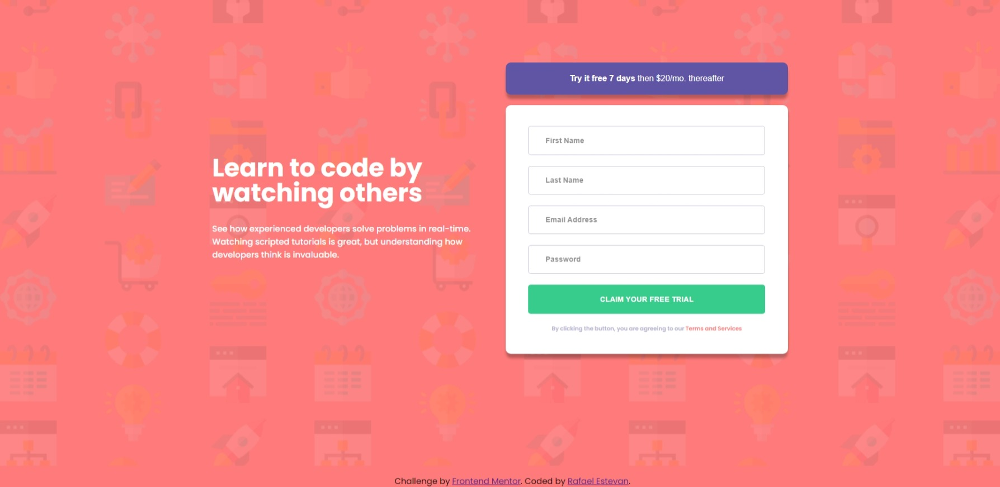

<h1 align="center">Intro component with sign-up form</h1>
<h3 align="center"><a href="https://rafaelestevan.github.io/intro-component-with-signup-form/">Live</a> | <a href="https://www.frontendmentor.io/challenges/intro-component-with-signup-form-5cf91bd49edda32581d28fd1">Challange</a></h3>
<h2 align="center">Screenshots</h3>

# Built with
* Semantic HTML5 markup
* CSS custom properties
* Grid
* Flex
* JavaScript

# Author
* FrontEnd Mentor [Rafael Estevan](https://www.frontendmentor.io/profile/RafaelEstevan)
* LinkedIn [Rafael Estevan](https://www.linkedin.com/in/rafael-estevan/)
* Twitter [@RafaEstevan_](https://twitter.com/RafaEstevan_)
